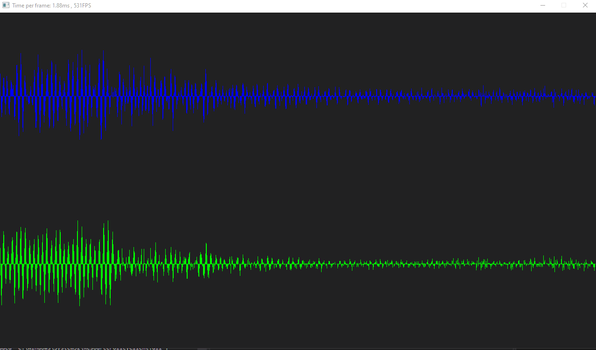

# PL
> A low-overhead platform abstraction layer along with tools and utilities for realtime applications.
> PL's API is completely stateful except utility functions. API design inspired by Per Vognsen's [Mu](https://www.youtube.com/watch?v=NG_mUhc8LRw) API

### Features:
- Window - software and OpenGL rendering.
- Input - Keyboard, mouse and xbox controller input.
- Audio - input (loopback and non-loopback) and output.
- Timing - delta and current time.
- Math - custom math library along with fast intrinsics for operations like squareroot.
- Threading - creating and controlling threads along with atomic "interlocked" operations.
- Basic File I/O - Loading from file, creating and loading into file, etc.
- Memory - OS calls for handling, requesting and operating on memory.

## Demo

(Green is Left audio channel, Blue is right audio channel)
